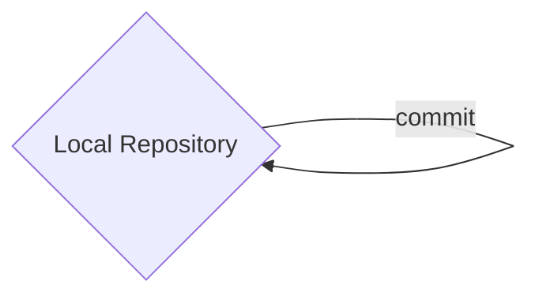
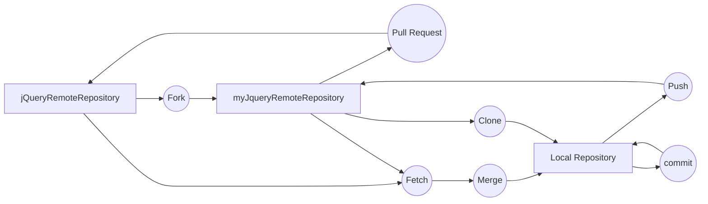

## GitHub

~~~mermaid
graph LR
A{jQueryRemoteRepository} --Fork --> B{myJqueryRemoteRepository}
B -- Pull Request --> A
~~~
## LocalMachine

## 전체 흐름

> 그래프가 엉망이다. 
> 하지만 난 이제 마크다운이 익숙하다.
> 좋은 현상 !

## Git & GitHub

### Git
> Git 이란 사용자의 로컬에서 버전 정보를 Git 서버에 올리거나, 서버에서 로컬로 내려받거나, 로컬에 버전 정보를 기록하는 등의 일을 한다. 

### GitHub
> Fork : 다른 사람 저장소를 가져와 나의 저장소로 만들어 놓는다. Push를 할 때 원 저장소에 기록되는 것이 아니라 나의 저장소에 기록된다. 
> Pull request : 원 저장소의 소유자 또는 권한자가 이를 검토하여 마음에 들면 업데이트 하거나, 토론을 한다.  
